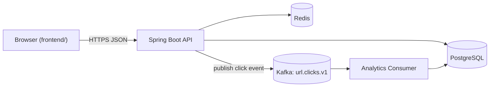
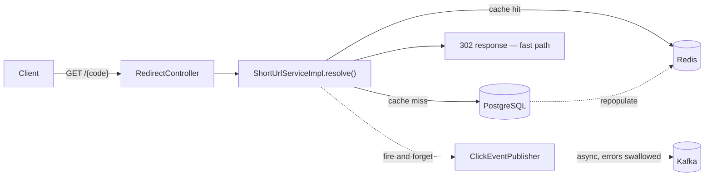
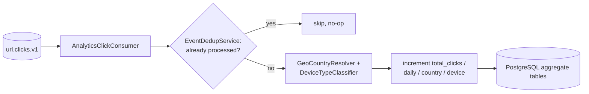
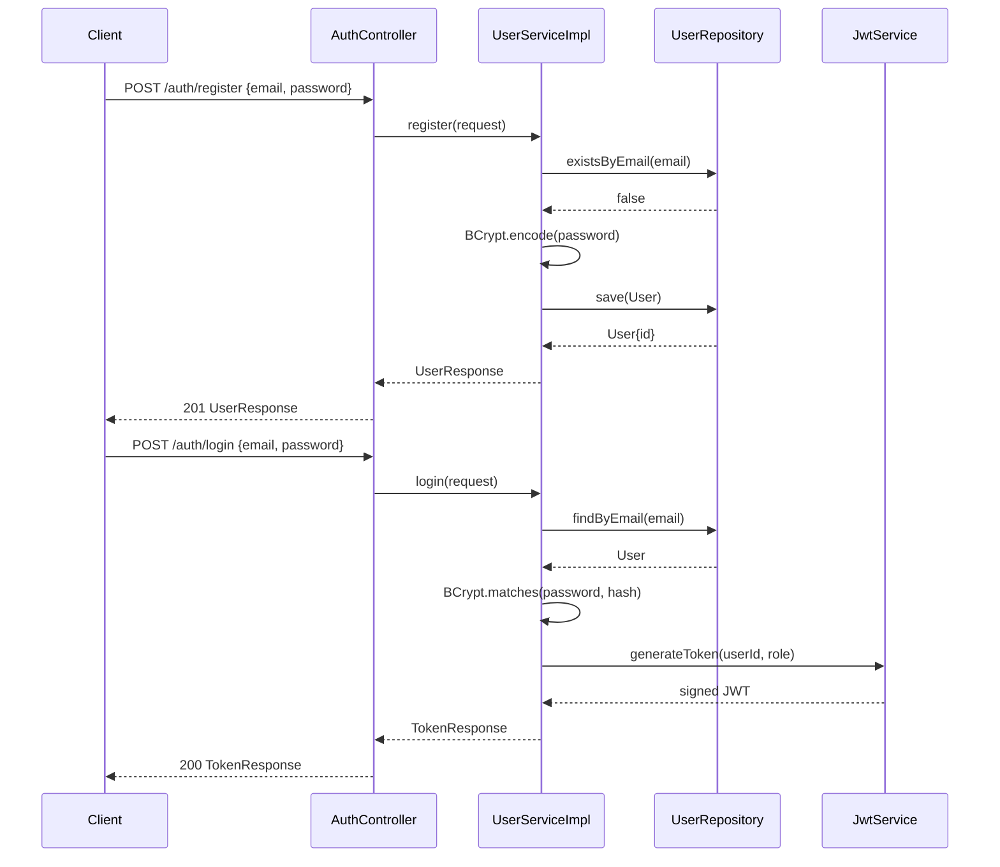
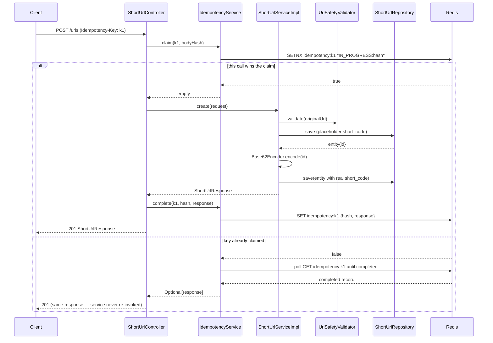
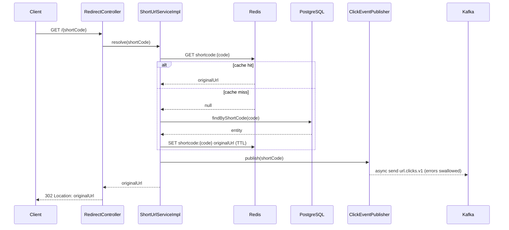
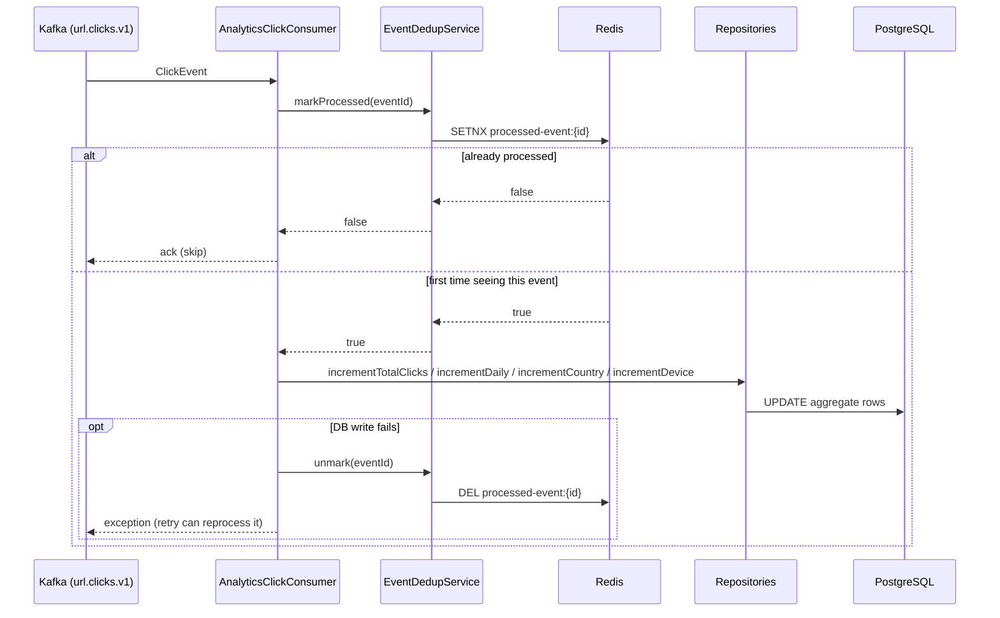
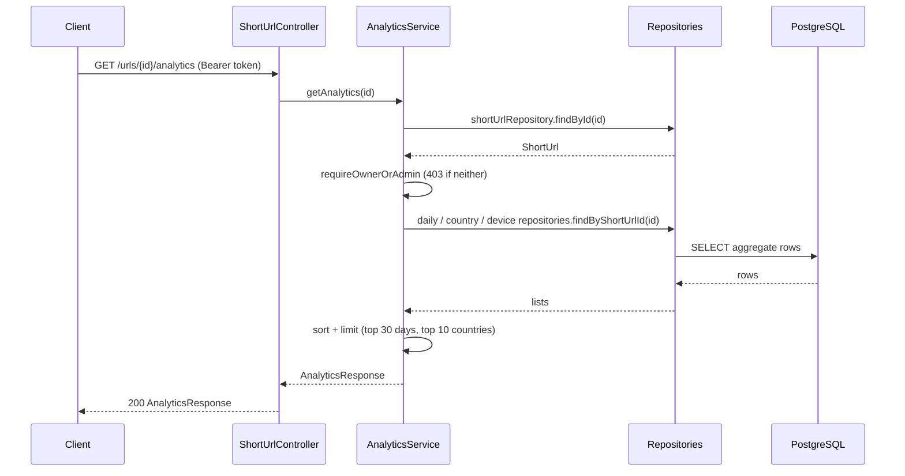

# System Design Document — ShortLink

A retrospective, whole-system explainer: what's actually built, how it fits together, and why. Unlike the per-stage plans in [`docs/planning/`](planning/ROADMAP.md), this document describes the system as it exists today, not as a build sequence.

## Table of Contents

1. [Overview](#1-overview)
2. [Functional Requirements](#2-functional-requirements)
3. [Non-Functional Requirements](#3-non-functional-requirements)
4. [High-Level Design](#4-high-level-design)
5. [Low-Level Design](#5-low-level-design)
6. [Code](#6-code)
7. [Database](#7-database)
8. [Caching](#8-caching)
9. [Not Yet Built](#9-not-yet-built)
10. [Appendix: Running It Locally](#10-appendix-running-it-locally)

---

## 1. Overview

ShortLink is a URL shortener: it turns a long URL into a short, shareable code, redirects visitors from that code back to the original destination, and tracks click analytics (volume over time, country, device type) without slowing the redirect down. Users register, log in with a JWT, and manage their own links — create, list, disable, delete — through either a REST API or a small browser-based demo page.

Both the backend API and the frontend demo are complete and working end-to-end today.

**Tech stack**

| Layer | Technology |
| --- | --- |
| Language / framework | Java 21, Spring Boot 3.3 |
| Web / data | Spring Web, Spring Data JPA, Spring Security |
| Cache / coordination | Redis 7 (Spring Data Redis) |
| Event streaming | Apache Kafka (KRaft mode) |
| Database | PostgreSQL 16, Flyway migrations |
| Auth | JWT (`jjwt`), BCrypt password hashing |
| Geo lookup | MaxMind GeoIP2 (`GeoCountryResolver`) |
| Testing | JUnit 5, Mockito, Testcontainers |
| Frontend | Plain HTML/CSS/vanilla JS — no build tooling, served independently, calls the API cross-origin (CORS) |

---

## 2. Functional Requirements

**Auth**
- Register with an email + password (`POST /api/v1/auth/register`) — password is BCrypt-hashed, never stored in plain text.
- Log in with email + password (`POST /api/v1/auth/login`) — returns a signed JWT.

**URL management**
- Create a short URL (`POST /api/v1/urls`), optionally with a custom alias, an expiration timestamp, and an `Idempotency-Key` header to make retried creates safe.
- Get a URL's details (`GET /api/v1/urls/{id}`).
- List the caller's own URLs, cursor-paginated (`GET /api/v1/urls?limit=&cursor=`).
- Disable a URL without deleting it (`POST /api/v1/urls/{id}/disable`) — owner or admin only.
- Delete a URL (`DELETE /api/v1/urls/{id}`) — owner or admin only.

**Redirect**
- Resolve a short code to its original URL and issue a 302 (`GET /{shortCode}`).
- Reject unsafe input URLs at creation time — malformed URLs, non-http(s) schemes, and destinations resolving to loopback/private/link-local addresses are all rejected (SSRF / open-redirect protection).

**Analytics**
- Per-URL click analytics (`GET /api/v1/urls/{id}/analytics`): total clicks, a daily breakdown (last 30 days), a top-10 country breakdown, and a device-type breakdown (desktop/mobile/tablet/bot).

Source: [`ShortUrlController.java`](../src/main/java/com/aninditb/shortlink/controller/ShortUrlController.java), [`AuthController.java`](../src/main/java/com/aninditb/shortlink/controller/AuthController.java), [`RedirectController.java`](../src/main/java/com/aninditb/shortlink/controller/RedirectController.java), [`AnalyticsService.java`](../src/main/java/com/aninditb/shortlink/analytics/AnalyticsService.java).

---

## 3. Non-Functional Requirements

- **Performance** — the redirect path is cache-aside (Redis first, Postgres fallback) and never waits on analytics; click events are published to Kafka asynchronously and swallow their own errors so a Kafka hiccup can never fail a redirect.
- **Consistency** — analytics are eventually consistent by design: the redirect returns before the click is durably counted. This is a deliberate latency-over-consistency trade-off, not an oversight.
- **Security** — JWT-based auth, per-user ownership checks (403 on cross-user modify/view), SSRF-safe URL validation on every create, BCrypt password hashing, CORS locked to a configured origin.
- **Reliability** — URL creation is idempotent under retry (Redis-backed atomic claim, not a check-then-act race); the Kafka consumer deduplicates by event ID so redelivery doesn't double-count a click, and un-marks the dedup key on a failed DB write so the event can actually be retried instead of being silently swallowed.
- **Scalability** — currently a single instance of each service (one app process, one Redis, one Postgres, one Kafka broker). No clustering or horizontal scaling exists yet — see [Not Yet Built](#9-not-yet-built).
- **Availability** — no failover or redundancy for any component today; a Redis or Postgres outage currently takes the corresponding feature down rather than degrading gracefully.

---

## 4. High-Level Design

**Point: overall system topology** — the browser-based demo and any direct API caller both talk to one Spring Boot process, which fans out to three backing stores.



**Point: write/read path split on redirect** — `GET /{shortCode}` returns as soon as Redis/Postgres has the destination URL; publishing the click event to Kafka happens after the response data is known but never blocks or fails the redirect itself.



**Point: async analytics pipeline** — fully decoupled from the request path; it runs on its own consumer thread whenever Kafka delivers a message.



---

## 5. Low-Level Design

**Point: Auth** — `AuthController` delegates entirely to `UserServiceImpl`; the controller has no knowledge of hashing or token format.



**Point: Create short URL** — the interesting part is the idempotency claim wrapping the actual create logic: only the request that wins the Redis reservation calls `ShortUrlServiceImpl.create`.



**Point: Redirect (cache hit vs miss)** — one diagram covering both branches, plus the parallel fire-and-forget click publish.



**Point: Async analytics consumer** — dedup happens in Redis before any database write, and unwinds itself if the write fails.



**Point: Get analytics** — a plain read path; ownership is enforced before any aggregate query runs.



---

## 6. Code

Real excerpts, not full file dumps — each is the part that carries the actual design decision.

**Short-code generation** — [`Base62Encoder.java`](../src/main/java/com/aninditb/shortlink/util/Base62Encoder.java)

```java
public static String encode(long value) {
    if (value < 0) {
        throw new IllegalArgumentException("value must be non-negative: " + value);
    }
    if (value == 0) {
        return String.valueOf(ALPHABET.charAt(0));
    }

    StringBuilder sb = new StringBuilder();
    long remaining = value;
    while (remaining > 0) {
        int digit = (int) (remaining % BASE);
        sb.append(ALPHABET.charAt(digit));
        remaining /= BASE;
    }
    return sb.reverse().toString();
}
```

The auto-increment primary key is Base62-encoded into the short code — simple and collision-free by construction, but it couples code generation to a single writer (a known limitation, not yet revisited).

**SSRF / private-IP rejection** — [`UrlSafetyValidator.java`](../src/main/java/com/aninditb/shortlink/validation/UrlSafetyValidator.java)

```java
String host = uri.getHost();
if (host == null || host.isBlank()) {
    throw new InvalidUrlException("URL is missing a host: " + rawUrl);
}

if (host.equalsIgnoreCase("localhost")) {
    throw new InvalidUrlException("URL host is not allowed: " + host);
}

InetAddress[] addresses;
try {
    addresses = InetAddress.getAllByName(host);
} catch (UnknownHostException e) {
    throw new InvalidUrlException("Unable to resolve URL host: " + host);
}

for (InetAddress address : addresses) {
    if (address.isLoopbackAddress()
            || address.isSiteLocalAddress()
            || address.isLinkLocalAddress()
            || address.isAnyLocalAddress()) {
        throw new InvalidUrlException("URL host resolves to a disallowed address range: " + host);
    }
}
```

Every hostname is actually resolved (not just pattern-matched) before it's accepted — this catches DNS names that point at private IP ranges, not just literal `127.0.0.1`/`localhost`.

**Idempotency claim** — [`IdempotencyService.java`](../src/main/java/com/aninditb/shortlink/service/IdempotencyService.java)

```java
public Optional<ShortUrlResponse> claim(String idempotencyKey, String bodyHash) {
    String redisKey = key(idempotencyKey);
    if (Boolean.TRUE.equals(redisTemplate.opsForValue()
            .setIfAbsent(redisKey, IN_PROGRESS_PREFIX + bodyHash, RESERVATION_TTL))) {
        return Optional.empty();
    }
    return awaitCompletion(redisKey, bodyHash);
}
```

A single atomic `SETNX` decides which concurrent request wins — this replaced an earlier check-then-act version that let concurrent retries create duplicate rows (fixed in [PR #104](https://github.com/AninditB/URL-shortener/pull/104)).

**Rate limiter** — [`RateLimiter.java`](../src/main/java/com/aninditb/shortlink/service/RateLimiter.java)

```java
public boolean tryAcquire(String identity, int maxRequests) {
    long windowStart = Instant.now().getEpochSecond() / window.getSeconds();
    String key = KEY_PREFIX + identity + ":" + windowStart;

    Long count = redisTemplate.opsForValue().increment(key);
    if (count != null && count == 1L) {
        redisTemplate.expire(key, window);
    }

    return count != null && count <= maxRequests;
}
```

Fixed-window counting keyed by identity *and* the current window number — the key itself changes every window, so there's nothing to reset.

**Redirect cache-aside** — [`ShortUrlServiceImpl.java`](../src/main/java/com/aninditb/shortlink/service/ShortUrlServiceImpl.java)

```java
public String resolve(String shortCode) {
    String cacheKey = cacheKey(shortCode);
    String cachedUrl = redisTemplate.opsForValue().get(cacheKey);
    if (cachedUrl != null) {
        clickEventPublisher.publish(shortCode);
        return cachedUrl;
    }
    // ... miss: load from Postgres, then:
    cacheActiveUrl(entity);
    clickEventPublisher.publish(shortCode);
    return entity.getOriginalUrl();
}
```

Every write path that changes a URL's validity (`delete`, `disable`, detecting expiry on read) explicitly calls `redisTemplate.delete(cacheKey)` — the cache is invalidated on write, not just left to expire on its own TTL.

**Kafka consumer dedup** — [`EventDedupService.java`](../src/main/java/com/aninditb/shortlink/analytics/EventDedupService.java)

```java
public boolean markProcessed(String eventId) {
    Boolean firstTime = redisTemplate.opsForValue().setIfAbsent(KEY_PREFIX + eventId, "1", ttl);
    return Boolean.TRUE.equals(firstTime);
}
```

Same atomic-claim pattern as idempotency, applied to Kafka's at-least-once delivery — a redelivered event is a no-op instead of a double-counted click.

---

## 7. Database

```mermaid
erDiagram
    USERS ||--o{ SHORT_URLS : owns
    SHORT_URLS ||--o{ URL_CLICK_DAILY : "aggregates into"
    SHORT_URLS ||--o{ URL_CLICK_COUNTRY : "aggregates into"
    SHORT_URLS ||--o{ URL_CLICK_DEVICE : "aggregates into"

    USERS {
        bigint id PK
        varchar email UK
        varchar password_hash
        varchar role
        timestamptz created_at
    }
    SHORT_URLS {
        bigint id PK
        varchar short_code UK
        text original_url
        varchar status
        timestamptz created_at
        timestamptz updated_at
        timestamptz expires_at
        bigint owner_id FK "nullable — anonymous creates allowed"
        bigint total_clicks
    }
    URL_CLICK_DAILY {
        bigint short_url_id PK_FK
        date click_date PK
        bigint click_count
    }
    URL_CLICK_COUNTRY {
        bigint short_url_id PK_FK
        varchar country PK
        bigint click_count
    }
    URL_CLICK_DEVICE {
        bigint short_url_id PK_FK
        varchar device_type PK
        bigint click_count
    }
```

Notes:
- `short_urls.short_code` has a real unique index (`uk_short_urls_short_code`), not just an application-level check — the create path relies on the DB to reject a race on custom aliases.
- `owner_id` is nullable: the create endpoint accepts anonymous requests, they just can't be listed/managed later since there's no owner to filter by.
- Each analytics table uses a composite primary key (`short_url_id` + the dimension being counted) instead of a surrogate key — this makes the consumer's increment an upsert (`ON CONFLICT`-style), not an insert-then-aggregate.
- Schema evolves through seven versioned Flyway migrations (`src/main/resources/db/migration/V1`…`V7`), one per schema change — `short_urls` and `users` first, then `owner_id`, then `total_clicks`, then the three click-aggregate tables.

---

## 8. Caching

Redis holds four independent keyspaces, distinguished purely by key prefix — same instance, four unrelated jobs:

| Prefix | Purpose | Written by | TTL | Invalidated by |
| --- | --- | --- | --- | --- |
| `shortcode:` | Cache-aside redirect lookup (short code → original URL) | `ShortUrlServiceImpl` | `min(expiresAt − now, 1h)`, default 1h | Explicit `DEL` on delete, disable, or expiry-detected-on-read |
| `idempotency:` | Create-request claim + replay | `IdempotencyService` | 30s while `IN_PROGRESS`, then `app.idempotency.ttl-hours` (default 24h) once completed | Natural TTL expiry only |
| `ratelimit:` | Fixed-window request counter, per identity | `RateLimiter` | `app.rate-limit.window-seconds` (default 60s) | Natural TTL expiry (new window = new key) |
| `processed-event:` | Kafka click-event dedup guard | `EventDedupService` | `app.analytics.dedup-ttl-days` | Explicit `DEL` if the DB write for that event fails (so a retry isn't silently skipped) |

This is the direct answer to "what is Redis doing": one **cache** (fast redirects), one **distributed lock/claim** (safe retries), one **rate limiter** (abuse control), one **dedup guard** (exactly-once-ish analytics) — sharing a Redis instance, never a keyspace.

---

## 9. Not Yet Built

Named plainly, no phase numbers — these are real gaps, not a to-do list ordering:

- Observability: no metrics, structured tracing, or dashboards (Micrometer/Prometheus/Grafana/OpenTelemetry).
- Resilience: no circuit breakers, bulkheads, or graceful degradation — a Redis or Postgres outage fails the dependent feature outright rather than degrading.
- Containerized deployment / CI-CD: no Dockerfile for the app itself, no automated build→test→deploy pipeline.
- High availability: single instance of the app, Redis, Postgres, and Kafka each — no replicas, no failover.
- Kubernetes / horizontal scaling: the app isn't stateless in a way that survives multiple writers cleanly yet (see the Base62/auto-increment note in [Code](#6-code)).
- Disaster recovery: no defined RPO/RTO, backup, or restore procedure.

See [`docs/planning/ROADMAP.md`](planning/ROADMAP.md) for the staged plan these gaps map to.

---

## 10. Appendix: Running It Locally

```bash
# 1. Start Postgres, Redis, and Kafka
docker compose up -d

# 2. Run the backend (APP_JWT_SECRET must be >= 32 bytes, no default)
APP_JWT_SECRET=<32+ byte secret> mvn spring-boot:run

# 3. Serve the frontend separately (from inside frontend/)
python -m http.server 5500
```

The backend listens on `http://localhost:8080`; the frontend expects it there by default (`frontend/js/api.js`'s `API_BASE`). Swagger UI is available at `http://localhost:8080/swagger-ui.html` once the backend is running.
