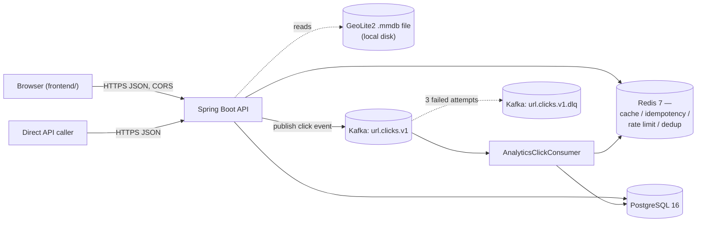
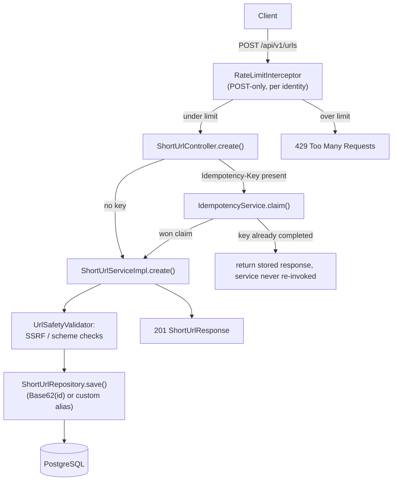
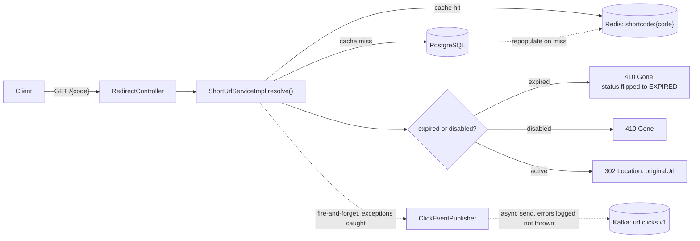
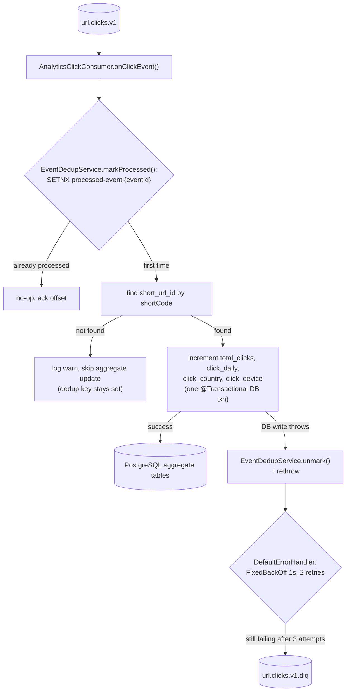

← [Index](../00-index.md)

## High-Level Design

### System topology

The frontend demo (`frontend/`) and any direct API caller both talk to one Spring Boot process (`ShortlinkApplication`), which fans out to three backing stores plus a lazily-loaded local GeoIP database file.

There is one Spring Boot process serving three roles at once: the synchronous REST API (`ShortUrlController`, `AuthController`), the redirect endpoint (`RedirectController`), and the Kafka consumer (`AnalyticsClickConsumer`) — all in the same JVM, no separate worker deployment. Redis is one physical instance shared across four unrelated jobs distinguished by key prefix (see [Caching](../implementation/caching.md)).

### Request flow: create short URL

`POST /api/v1/urls` is guarded by two independent concerns before `ShortUrlServiceImpl.create()` ever runs: a per-identity rate limit (`RateLimitInterceptor`, Spring MVC interceptor on this path only) and an optional idempotency claim (`IdempotencyService`, only engaged when the caller sends an `Idempotency-Key` header).

Two write paths exist depending on whether the caller supplies a `customAlias`: a custom alias is checked with `existsByShortCode()` then inserted directly, while an auto-generated code is derived from the row's own auto-increment id (insert with a placeholder code, then `UPDATE` to `Base62Encoder.encode(id)`) — see [Database](../implementation/database.md) for the schema and [Known gaps](#known-gaps--tech-debt) below for the collision risk this creates between the two paths.

### Request flow: redirect

`GET /{shortCode}` is on the hot path and is optimized to return as soon as the destination URL is known — cache first, Postgres fallback, and the Kafka click-event publish happens after the response value is already determined and never blocks or fails the redirect.

Expiry is checked lazily on read (`resolve()`, `getDetails()`), not by a background sweep — a row can sit `ACTIVE` in the database past its `expiresAt` until the next time someone hits it, at which point it's flipped to `EXPIRED` and its cache entry is deleted. `ClickEventPublisher.publish()` wraps its entire body (not just the async Kafka send) in a catch-all, because building the `ClickEvent` — specifically `GeoCountryResolver`'s first real GeoIP lookup — can itself throw synchronously; that guarantee is what makes "analytics can never break a redirect" (NFR: performance) actually hold.

### Async flow: analytics pipeline

Fully decoupled from the request path. It runs on a `@KafkaListener`-managed consumer thread inside the same JVM, triggered whenever Kafka delivers a message — there's no separate consumer process today.

The country and device dimensions are resolved on the *producer* side (`ClickEventPublisher`, at redirect time — `GeoCountryResolver` + `DeviceTypeClassifier`) and travel inside the `ClickEvent` payload; the consumer only aggregates, it does no lookups of its own. The consumer group is configured `auto-offset-reset: earliest`, so a fresh or reset consumer group replays the full topic backlog rather than silently skipping it — safe because of the Redis dedup guard, but means a long-idle DLQ or a new consumer group will reprocess history.

### Key design decisions and rationale

| Decision | Rationale |
| --- | --- |
| Cache-aside for redirects, not write-through | The redirect path only needs to be fast on read; write-through would pay caching cost on every create for URLs that may never be visited. |
| Click events published *after* the redirect's response value is known, and swallow their own errors | A Kafka outage or slow broker must never turn into a slow or failed redirect (NFR: performance) — see `ClickEventPublisher`'s catch-all and `resolve()` never awaiting the publish. |
| Atomic Redis `SETNX` claim for idempotent creates, not check-then-act | An earlier check-then-act version let two concurrent retries with the same `Idempotency-Key` both observe "not yet used" and both create a row — fixed by making the claim itself the atomic operation (see [PR #104](https://github.com/AninditB/URL-shortener/pull/104), and [Low-Level Design](low-level.md) for the full sequence). |
| Event dedup via Redis `SETNX` before any DB write, unmark-on-failure | Kafka is at-least-once, so redelivery is expected. `SETNX processed-event:{id}` makes redelivery a no-op; the `unmark()` on a failed DB write is what keeps that guarantee from silently eating events that should have gone through retry/DLQ instead. |
| `FixedBackOff(1000ms, 2)` + `DeadLetterPublishingRecoverer` on the consumer | 3 total attempts a second apart is enough to ride out a transient DB blip without holding up the partition for long; anything still failing goes to `url.clicks.v1.dlq` instead of blocking or being silently dropped. |
| Auto-increment PK, Base62-encoded, as the default short code | Simple and collision-free *by construction* for the auto-generated path alone — but it couples code generation to a single writer and, as built, does **not** cross-check against already-taken custom aliases (see [Known gaps](#known-gaps--tech-debt)). |
| Ownership is nullable (`owner_id`), not required | The create endpoint accepts anonymous requests by design; the trade-off is that an anonymous URL can never be listed, disabled, or have its analytics viewed later, since there's no owner to authorize against — `requireOwnerOrAdmin()` only rejects a *mismatched* owner, so a `null`-owner row is effectively public to anyone who knows its id. |
| Analytics are eventually consistent | The redirect returns before the click is durably counted — a deliberate latency-over-consistency trade-off (NFR: consistency), not an oversight. |

### Known gaps / tech debt

- **Auto-generated short-code collision with a taken custom alias (open bug).** `ShortUrlServiceImpl.create()`'s auto-generate path inserts a placeholder row, then `UPDATE`s `short_code` to `Base62Encoder.encode(id)` in a second `save()`. That second save is not guarded by any catch for `DataIntegrityViolationException`, and `GlobalExceptionHandler` has no handler for it either — so if a user previously claimed a custom alias that happens to equal a future auto-increment id's Base62 encoding (e.g. alias `"b"` collides with whatever row eventually gets id 62), the auto-generate path's second save throws unhandled and the caller gets a raw 500 instead of a clean conflict response. The DB's `uk_short_urls_short_code` unique index is what actually prevents the bad row from being written — but nothing surfaces that as a proper `409`.
- **GeoIP resolver has no real-database test.** `GeoCountryResolverTest` mocks `GeoIp2Provider` entirely; there is no test that loads an actual GeoLite2 `.mmdb` fixture and exercises `GeoIpConfig`'s `DatabaseReader` bean end-to-end, so a bad `app.geoip.database-path` or a `DatabaseReader.Builder` regression would only surface at runtime, not in CI.
- See [Not Yet Built](../not-yet-built.md) for the larger, deliberately-deferred gaps (observability, resilience, HA, deployment).
