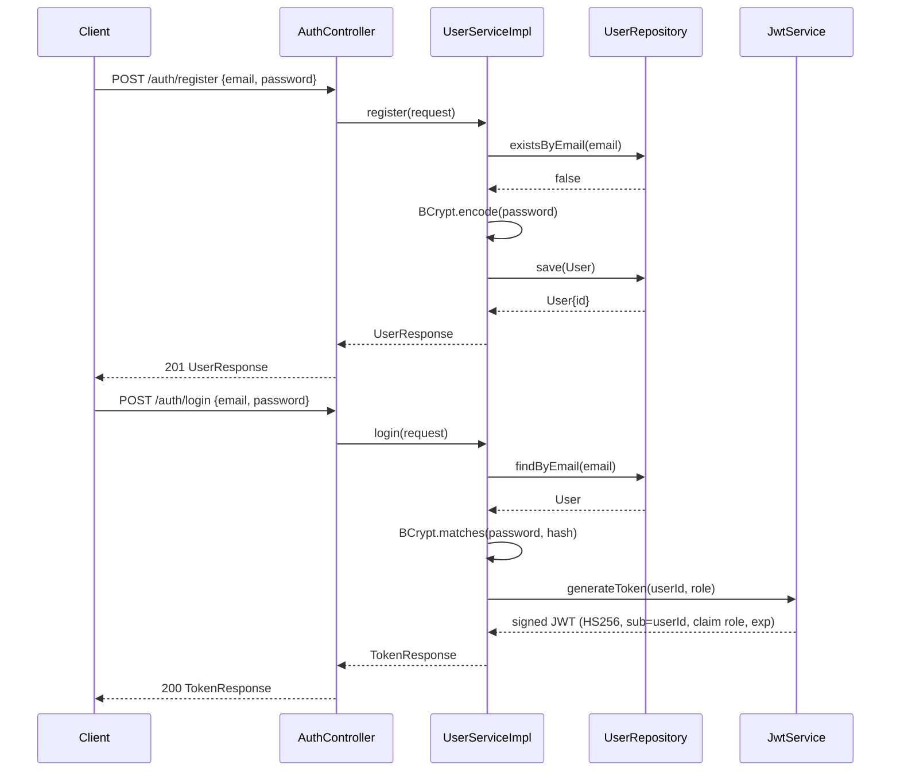
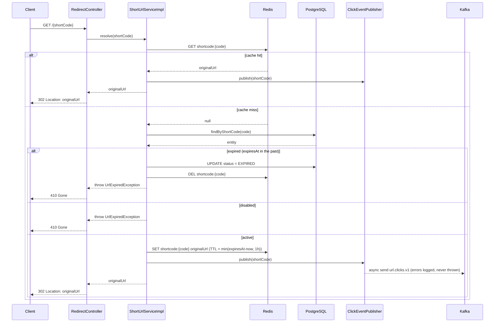
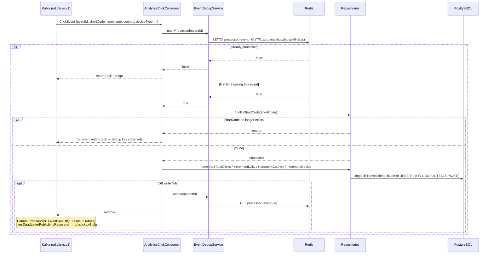
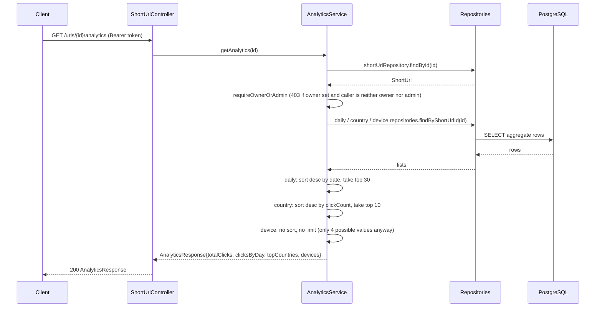

← [Index](../00-index.md)

## Low-Level Design

### Component responsibilities

| Component | Responsibility |
| --- | --- |
| `AuthController` / `UserServiceImpl` | Register, login. No hashing or token logic in the controller — delegated entirely to the service. |
| `ShortUrlController` | Create/get/list/delete/disable/enable/analytics endpoints under `/api/v1/urls`. Owns idempotency-key plumbing (hashing the request body, calling `IdempotencyService`) — `ShortUrlServiceImpl` itself has no idempotency awareness. |
| `RedirectController` | The single `GET /{shortCode}` hot path; just calls `resolve()` and turns the result into a 302. |
| `ShortUrlServiceImpl` | Create, resolve (cache-aside), get/list/delete/disable/enable, all ownership checks for URL mutation/read. Transactional per method. |
| `AnalyticsService` | Read-only aggregate query path for `GET /urls/{id}/analytics`; enforces ownership before querying, then sorts/limits in memory. |
| `IdempotencyService` | Atomic Redis claim (`SETNX`) + poll-for-completion for `POST /urls` retries. |
| `RateLimiter` / `RateLimitInterceptor` | Fixed-window Redis counter (`INCR` + `EXPIRE` on first hit), applied only to `POST /api/v1/urls` by `WebMvcConfig`, keyed by user id if authenticated else by remote IP. |
| `ClickEventPublisher` | Builds a `ClickEvent` (geo + device classification included) and publishes it to Kafka asynchronously; every failure mode — including exceptions while *building* the event — is caught and logged, never thrown. |
| `GeoCountryResolver` | Wraps a lazily-initialized MaxMind `DatabaseReader` behind the `GeoIp2Provider` interface; resolves an IP to an ISO country code or `"UNKNOWN"`. |
| `DeviceTypeClassifier` | Pure static function, User-Agent string → `DeviceType` enum (`BOT` > `TABLET` > `MOBILE` > `DESKTOP`, checked in that order). |
| `AnalyticsClickConsumer` | Kafka `@KafkaListener` on `url.clicks.v1`; dedup-guards via `EventDedupService`, then does one `@Transactional` batch of aggregate increments per event. |
| `EventDedupService` | Same atomic-claim pattern as `IdempotencyService`, applied to Kafka's at-least-once delivery. |
| `KafkaConfig` | Producer/consumer factories, topic declarations (`url.clicks.v1`, `url.clicks.v1.dlq`), retry + DLQ wiring (`DefaultErrorHandler` + `FixedBackOff`). |
| `UrlSafetyValidator` | Rejects malformed URLs, non-http(s) schemes, and any hostname that *resolves* to a loopback/site-local/link-local/any-local address — actual DNS resolution, not string pattern matching. |
| `JwtService` / `JwtAuthenticationFilter` | Token issuance (HMAC-signed, `sub`=userId, `role` claim) and per-request parsing into a `UsernamePasswordAuthenticationToken(userId, null, [ROLE_x])`; a bad/expired token clears the security context rather than rejecting the request outright (authorization matchers decide what's actually required). |

### Auth

`AuthController` delegates entirely to `UserServiceImpl`; the controller has no knowledge of hashing or token format.



`existsByEmail` / `findByEmail` are check-then-act at the application layer (no unique-index race handling like `short_urls.short_code` has) — acceptable here since `users.email` collisions are rare in practice and not currently a known bug, but worth noting as the same shape of risk that caused the idempotency race below.

### Create short URL

Every `POST /api/v1/urls` first passes `RateLimitInterceptor` (fixed-window Redis counter, POST-only). If an `Idempotency-Key` header is present, the create logic itself is wrapped in a claim/complete pair — only the request that wins the Redis reservation calls `ShortUrlServiceImpl.create()`; without the header, `create()` runs unconditionally on every call.

```mermaid
sequenceDiagram
    participant C as Client
    participant RLI as RateLimitInterceptor
    participant SC as ShortUrlController
    participant IS as IdempotencyService
    participant SS as ShortUrlServiceImpl
    participant V as UrlSafetyValidator
    participant R as ShortUrlRepository
    participant Redis as Redis

    C->>RLI: POST /urls (Idempotency-Key: k1)
    RLI->>Redis: INCR ratelimit:{identity}:{window}
    Redis-->>RLI: count <= limit
    RLI->>SC: proceed
    SC->>IS: claim(k1, bodyHash)
    IS->>Redis: SETNX idempotency:k1 "IN_PROGRESS:hash"
    alt this call wins the claim
        Redis-->>IS: true
        IS-->>SC: empty
        SC->>SS: create(request)
        SS->>V: validate(originalUrl)
        alt customAlias supplied
            SS->>R: existsByShortCode(alias)
            R-->>SS: false
            SS->>R: save(entity with alias short_code)
        else auto-generated code
            SS->>R: save (placeholder short_code, e.g. "tmp-...")
            R-->>SS: entity{id}
            SS->>SS: Base62Encoder.encode(id)
            SS->>R: save(entity with short_code = Base62(id))
            note over R: unique index uk_short_urls_short_code<br/>can reject this 2nd save if a prior<br/>custom alias == Base62(id) — see<br/>Known Gaps in high-level.md; this path<br/>has no DataIntegrityViolationException<br/>handler today, so it surfaces as a raw 500
        end
        R-->>SS: entity
        SS-->>SC: ShortUrlResponse
        SC->>IS: complete(k1, hash, response)
        IS->>Redis: SET idempotency:k1 {hash, response} (TTL 24h default)
        SC-->>C: 201 ShortUrlResponse
    else key already claimed
        Redis-->>IS: false
        IS->>Redis: poll GET idempotency:k1 (up to 10x, 200ms apart)
        Redis-->>IS: completed record
        IS-->>SC: Optional[response]
        SC-->>C: 201 (same response — service never re-invoked)
    end
```

If polling exhausts all attempts without seeing a completed record, `IdempotencyService` throws `IdempotencyConflictException` → `409`. A mismatched body hash against an in-progress or completed key with the same `Idempotency-Key` also throws that same `409` — the key is scoped to one exact request body, not just the header value.

### Redirect (cache hit / miss / expired / disabled)



Note the click publish only fires on the hit and active-miss branches — an expired or disabled URL returns `410` without generating a click event. `UrlExpiredException` is reused for both the "actually expired" and "explicitly disabled" cases; the response body's message text is the only way a caller distinguishes them today.

### Async analytics consumer

Dedup happens in Redis *before* any database write, and unwinds itself if the write fails so a Kafka redelivery can actually be retried rather than silently skipped.



The daily/country/device increments are native `INSERT ... ON CONFLICT DO UPDATE` upserts against each table's composite primary key (`short_url_id` + dimension), not a select-then-update — see [Database](../implementation/database.md).

### Get analytics

A plain read path; ownership is enforced before any aggregate query runs, and only two of the three dimensions are actually sorted/capped.



`requireOwnerOrAdmin` only rejects when `ownerId` is set *and* the caller is neither the owner nor `ROLE_ADMIN`; a `null`-owner (anonymous-created) URL's analytics are readable by anyone who knows its id, same as its details.

### Ownership / authorization model

- Authentication is stateless JWT, parsed per-request by `JwtAuthenticationFilter` into a `Long` principal (the user id) with a single `ROLE_x` authority — there is no session, no refresh token, and a parse failure silently clears the security context rather than returning `401` directly (the endpoint's own matcher then decides whether that matters).
- `SecurityConfig`'s `authorizeHttpRequests` only forces authentication on `DELETE /urls/**`, `POST /urls/*/disable`, and `GET /urls` / `GET /urls/*`; everything else (including `POST /urls`, `POST /urls/*/enable`, and `GET /urls/*/analytics`) is `permitAll` at the filter-chain level — true ownership enforcement for those happens *inside* the services (`requireOwnerOrAdmin`), not at the security-filter layer. This means an anonymous `POST /urls/*/enable` on someone else's URL reaches `ShortUrlServiceImpl.enable()` before being rejected there, rather than being turned away at the perimeter.
- `requireOwnerOrAdmin` (duplicated identically in `ShortUrlServiceImpl` and `AnalyticsService`) is the actual authorization check everywhere it matters: `ownerId == null` → allowed (anonymous URLs have no owner to protect); `ownerId != null` → allowed only for that same user id or `ROLE_ADMIN`.
