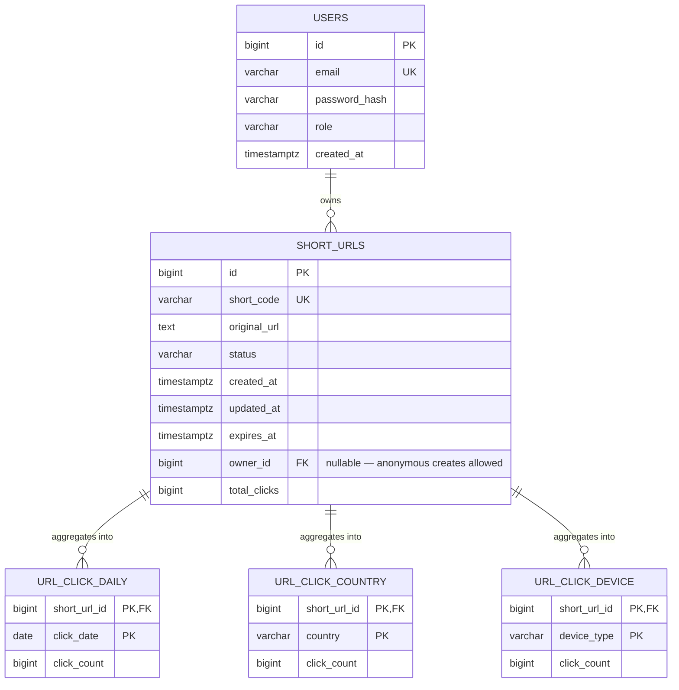

← [Index](../00-index.md)

## Database

Notes:
- `short_urls.short_code` has a real unique index (`uk_short_urls_short_code`), not just an application-level check — the create path relies on the DB to reject a race on custom aliases. There is one known unhandled case where that index rejects a save: an auto-generated code colliding with a pre-existing custom alias surfaces as a raw `500`, not a `409` — see [High-Level Design: Known gaps](../design/high-level.md#known-gaps--tech-debt).
- `owner_id` is nullable: the create endpoint accepts anonymous requests, they just can't be listed/managed later since there's no owner to filter by.
- Each analytics table uses a composite primary key (`short_url_id` + the dimension being counted) instead of a surrogate key — this makes the consumer's increment an upsert (`ON CONFLICT`-style), not an insert-then-aggregate.
- Schema evolves through seven versioned Flyway migrations (`src/main/resources/db/migration/V1`…`V7`), one per schema change — `short_urls` and `users` first, then `owner_id`, then `total_clicks`, then the three click-aggregate tables.
